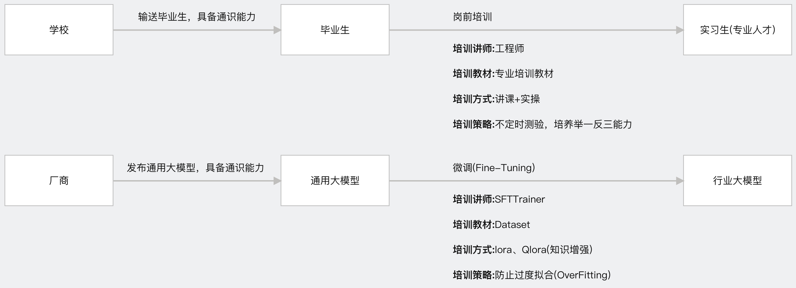
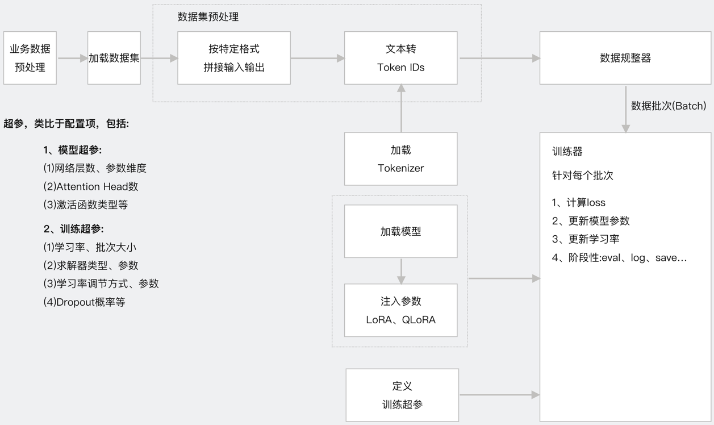

# 1、项目介绍 
**项目对应视频:**                                  
https://www.bilibili.com/video/BV1NVzwYnEwJ/?vd_source=30acb5331e4f5739ebbad50f7cc6b949                
https://youtu.be/aHjNlTxcMGQ           

免费开源分享AGI(通用人工智能)相关硬核干货。干货很硬不要怕，南哥带你搞定它                   
**南哥AGI研习社YouTube频道:** https://www.youtube.com/@NangePlus2024      
**南哥AGI研习社B站频道:** https://space.bilibili.com/509246474                   

## 1.1 项目简介       
本项目旨在提供一个微调酒店推荐垂直领域大模型并应用的完整闭环案例作为大家的参考案例。本项目使用的基础大模型为Qwen2.5-7B-Instruct                               
**完整的垂直应用案例闭环**                   
**项目源码剖析开源共享**                      
**详实的图文指导手册**        
**手把手全流程实操演示视频**         

## 1.2 主要内容
**(1)构建业务数据库**                
详情见weaviate文件夹               
**(2)数据增强、制作数据集**                
详情见dataAugmentation文件夹            
**(3)轻量化大模型微调**                      
详情见qwen2文件夹                 
**(4)大模型应用测试**                 
详情见webDemo文件夹              
**(5)封装大模型推理应用接口并测试**                            
详情见webApiDemo文件夹                    

## 1.3 什么是微调        
不严谨的类比，通俗理解什么是大模型微调        
            
轻量化微调流程图               
                      

# 2、前期准备工作
## 2.1 开发环境搭建:anaconda、pycharm
anaconda:提供python虚拟环境，官网下载对应系统版本的安装包安装即可                                      
pycharm:提供集成开发环境，官网下载社区版本安装包安装即可                                               
可参考如下视频进行安装，【大模型应用开发基础】集成开发环境搭建Anaconda+PyCharm                                                          
https://www.bilibili.com/video/BV1q9HxeEEtT/?vd_source=30acb5331e4f5739ebbad50f7cc6b949                             
https://youtu.be/myVgyitFzrA          

## 2.2 大模型相关配置
(1)GPT大模型使用方案              
(2)非GPT大模型(国产大模型)使用方案(OneAPI安装、部署、创建渠道和令牌)                 
(3)本地开源大模型使用方案(Ollama安装、启动、下载大模型)                         
可参考如下视频:                         
提供一种LLM集成解决方案，一份代码支持快速同时支持gpt大模型、国产大模型(通义千问、文心一言、百度千帆、讯飞星火等)、本地开源大模型(Ollama)                       
https://www.bilibili.com/video/BV12PCmYZEDt/?vd_source=30acb5331e4f5739ebbad50f7cc6b949                 
https://youtu.be/CgZsdK43tcY           

## 2.3 GPU服务器
这里大模型微调所使用的服务器是租用的AutoDL算力平台                        
https://www.autodl.com/home                
GPU:RTX 4090D(24GB)            
CPU:16 vCPU Intel(R) Xeon(R) Platinum 8481C            
内存:80GB                
硬盘:系统盘30GB、数据盘50GB                
GPU驱动:550.107.02                   
CUDA版本：<=12.4              

# 3、项目初始化
## 3.1 下载源码
GitHub或Gitee中下载工程文件到本地，下载地址如下：                
https://github.com/NanGePlus/FineTuningLab                                                                    
https://gitee.com/NanGePlus/FineTuningLab                                                       

## 3.2 构建项目
使用pycharm构建一个项目，为项目配置虚拟python环境               
项目名称：FineTuningLab                                                    

## 3.3 将相关代码拷贝到项目工程中           
直接将下载的文件夹中的文件拷贝到新建的项目目录中             

              
              
