# 1、大模型轻量化微调步骤
## 1.1 环境搭建
选择 AutoDL 的 4090 云 GPU 做为训练测试环境。因为独立部署自己训练的大模型， 4090 是目前性价比最高的方案            
(1) 注册AutoDL并进行实名认证           
AutoDL官网链接：https://www.autodl.com/         
根据平台要求进行账号注册，注册成功登录平台进行实名认证，按照官方要求进行认证即可                 
(2) 挑选GPU             
在官网首页点击算力市场菜单进入并进行GPU选择，参考如下截图配置进行选择即可(参考)             
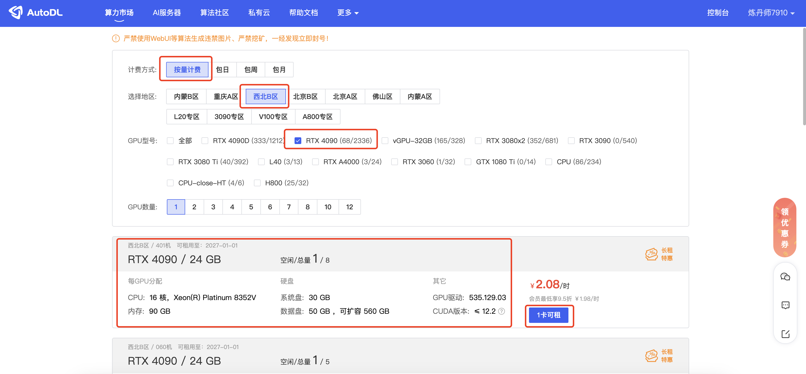                      
(3) 创建实例         
GPU选择确定后，单击n卡可租进入创建实例页面，并按照如下截图进行配置                    
其中，镜像选择使用基础镜像，这里选择Miniconda/conda3/3.10(ubuntu22.04)/11.8                                    
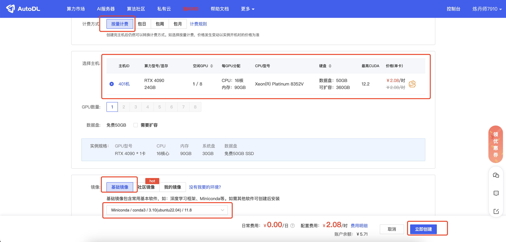          
实例创建成功如下截图所示，当状态为运行中时，表示创建完成，并且开始计费                      
如果要暂停计费，请点击关机。下次需要使用时，再点击开机，这里需要注意官方相关的限制策略                  
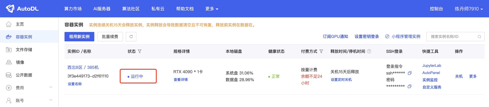                    
(4) 连接实例               
这里推荐大家使用SSH客户端软件远程登录到服务器，并同时连接SFTP服务进行文件的上传下载            
连接信息可在如下截图所示的地方获取             
                   
打开SSH客户端工具(这里使用的Mac，工具为Termius)进行远程连接，按照如下截图所示进行配置即可              
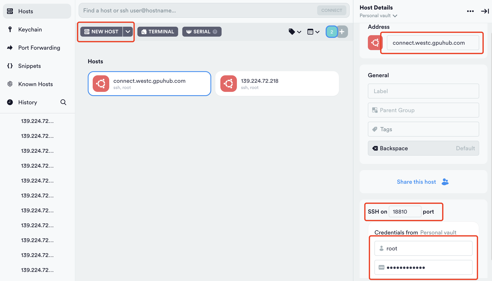              
配置成功后，如下截图所示              
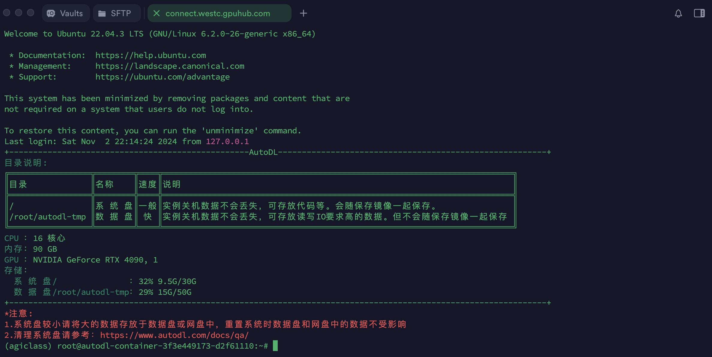            
同样的方式连接SFTP服务，连接成功后如下截图所示                 
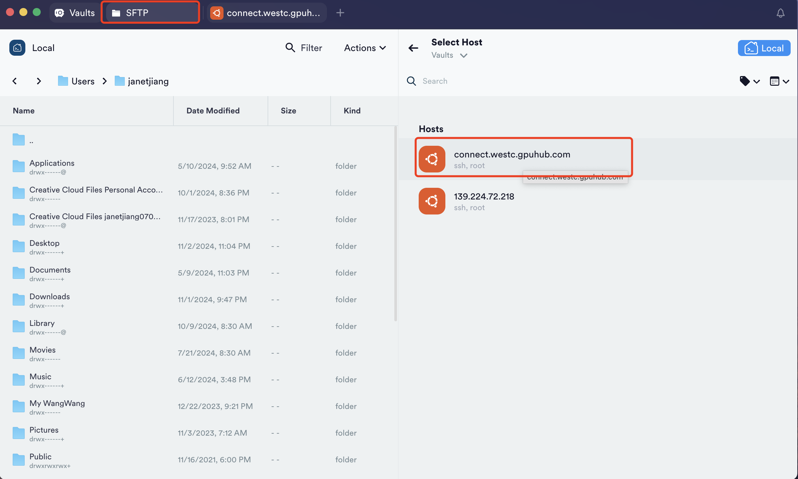              
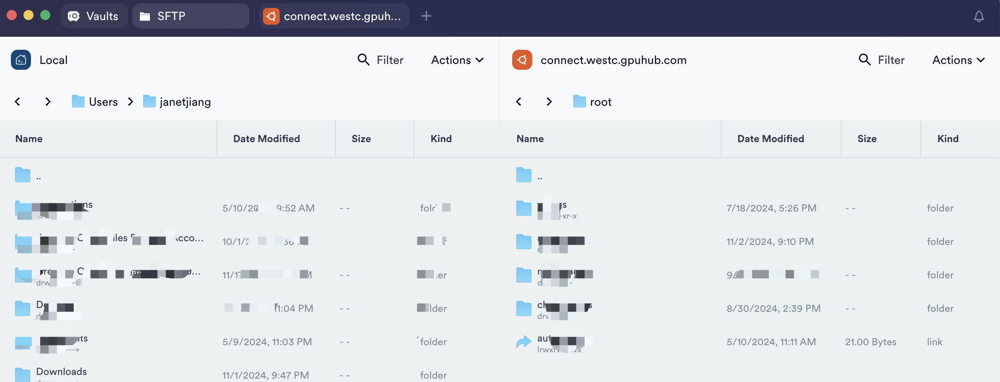                

## 1.2 下载预训练模型
所使用的预训练模型Qwen2.5-7B-Instruct从HuggingFace下载                 
考虑到国内访问HuggingFace比较慢，这里使用hf-mirror，官网链接 https://hf-mirror.com/Qwen/Qwen2.5-7B-Instruct           
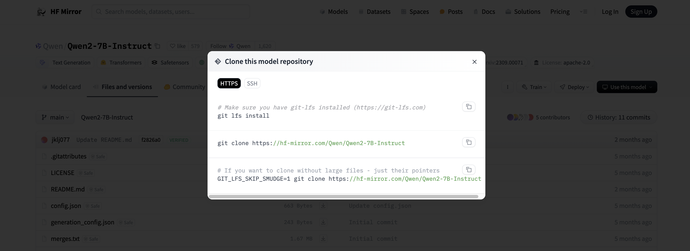            
执行如下命令行进行模型下载:          
`cd /root/autodl-tmp`   
`sudo apt-get update`                     
`sudo apt-get install git-lfs`                      
`git lfs install`                              
`git clone https://hf-mirror.com/Qwen/Qwen2.5-7B-Instruct`                                     
或执行如下(二选一即可)                
`git clone https://www.modelscope.cn/Qwen/Qwen2.5-7B-Instruct.git`                                  
执行完成后，耐心等待下载完成即可，这个过程需要持续大概30分钟左右                 
下载完成后，查看文件，清除掉.git目录，避免数据盘空间不足                           
`cd Qwen2.5-7B-Instruct`                                  
`rm -rf .git`                
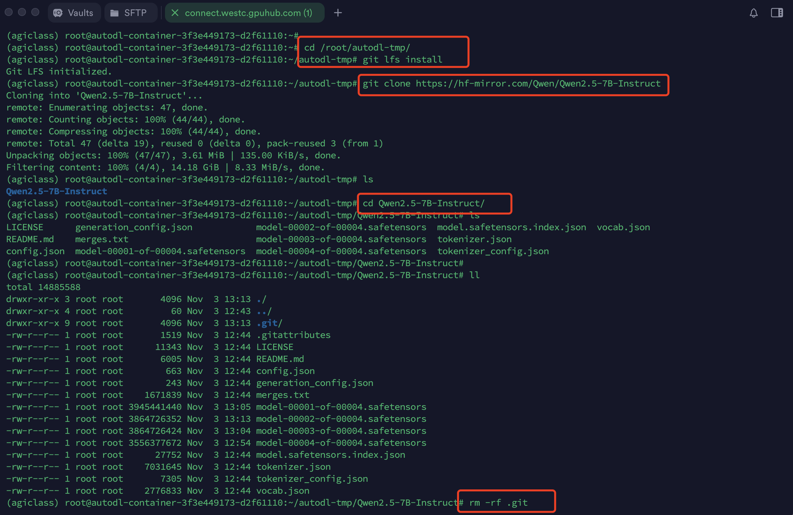               

## 1.3 模型训练
(1)打包代码上传服务器             
将代码先进行压缩为zip包，通过SFTP进行上传至/root/autodl-tmp目录下            
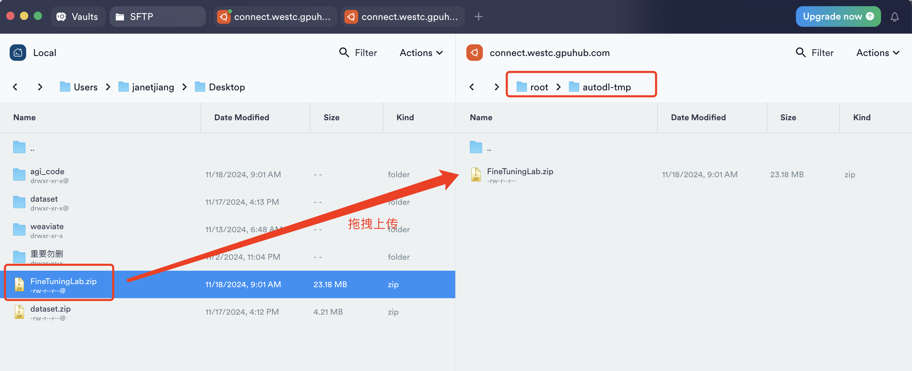               
上传成功后，在服务器命令行终端中进行解压              
`cd /root/autodl-tmp`                     
`unzip FineTuningLab.zip`                                  
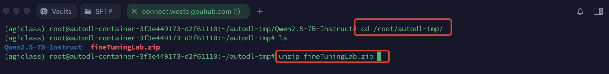                
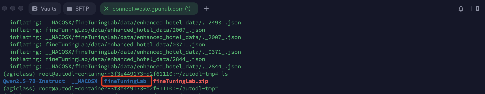                  
(2)安装所需依赖包            
在微调之前先安装相关依赖包，执行如下命令进行安装          
`cd /root/autodl-tmp/FineTuningLab/qwen2/`                                       
`pip install -r requirements.txt`                                  
每个软件包后面都指定了本次视频测试中固定的版本号                
注意: 建议先使用要求的对应版本进行本项目测试，避免因版本升级造成的代码不兼容。测试通过后，可进行升级测试       
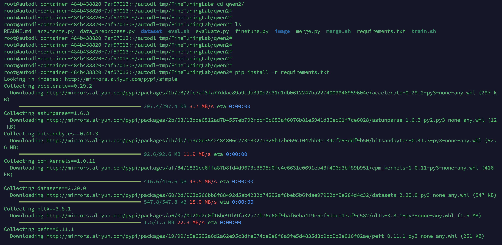           
(3)进行训练             
这里使用lora进行微调训练，命令行终端执行下面的命令，开始训练                
`cd /root/autodl-tmp/FineTuningLab/qwen2/`                              
`bash train.sh`                                
训练期间要保持网络连接，否则会导致前台训练任务进程被kill从而导致训练失败                
训练过程中会有运行的进度条，整个训练耗时需要45分钟左右                 
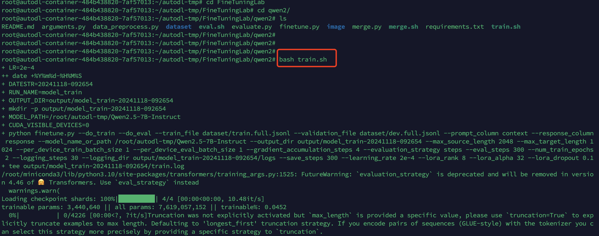              
当训练的进度条走完，说明训练完成。训练生成的文件在/root/autodl-tmp/Fine-tuning-lab/qwen2/output目录下            
checkpoint-nnn是训练过程中的中间结果，nnn数字最大的那个是最终结果              
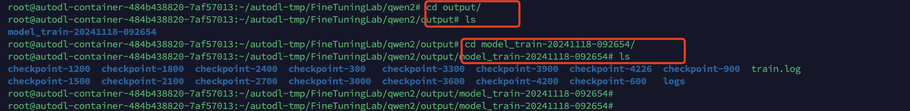                 
(4)训练过程可视化               
再新建一个终端，使用tensorboard工具进行训练可视化，将记录的loss可视化展示，终端命令行运行如下命令                       
 `tensorboard --logdir=output/model_train-20241118-092654/ --bind_all`                       
其中，--logdir的内容为训练过程中生成内容，如output/model_train-20241118-092654                   
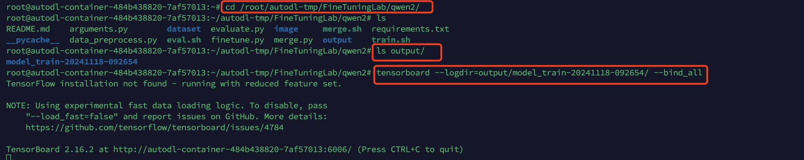             
运行成功后，在AutoDL实例中可以通过自定义服务访问到tensorboard可视化web页，如下截图所示：              
                   
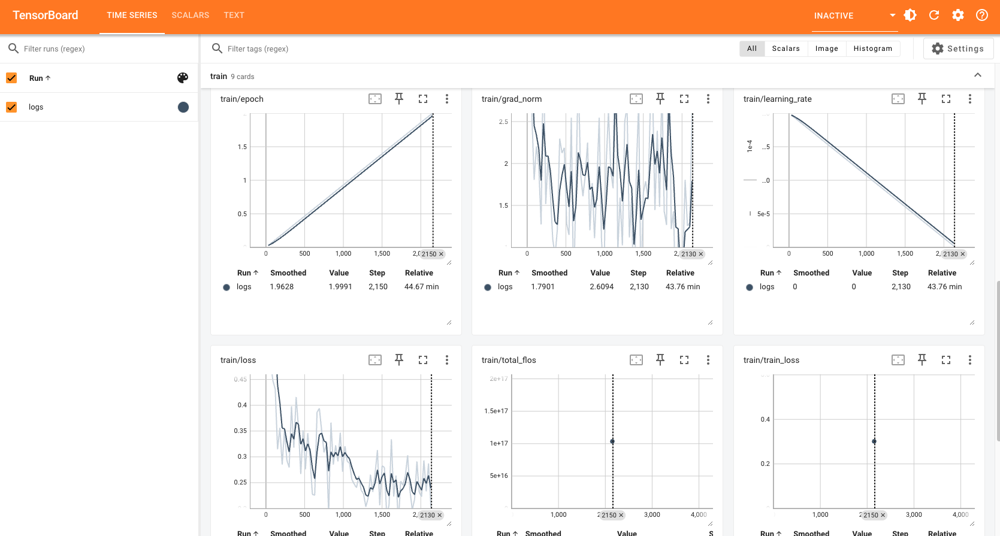               

## 1.4 模型指标测试
训练完成后，在测试集上进行推理测试，并计算出SLOT和BLEU的指标            
在运行测试指令前，需要修改对应的checkpoint文件所在路径                
`cd qwen2`                           
`vim eval.sh`                                 
在打开的文件中，将对应的文件夹路径调整为自己的checkpoint文件所在路径               
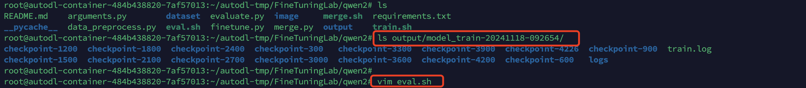                
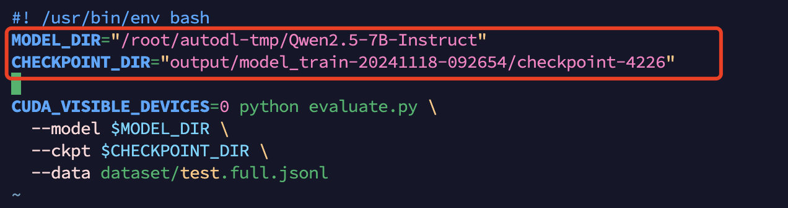                  
调整完成后，保存退出，然后执行如下命令               
`bash eval.sh`                               
运行结束后，整个测试耗时需要13分钟左右，结果如下图所示                
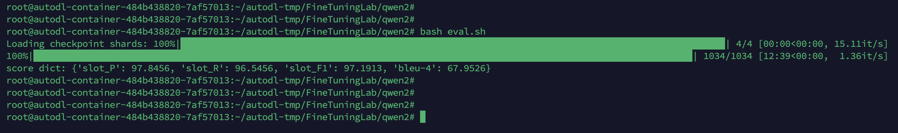               

## 1.5 合并模型
测试完成后，进行模型的合并，在运行测试指令前，需要修改对应的checkpoint文件所在路径             
`cd qwen2`                         
`vim merge.sh`                              
在打开的文件中，将对应的文件夹路径调整为自己的checkpoint文件所在路径           
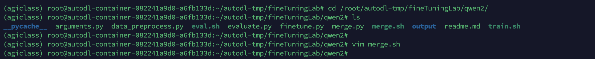                 
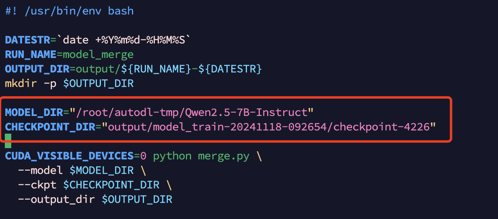               
执行`bash merge.sh`                        
运行成功后，可在output目录内获取到合并后的模型                 
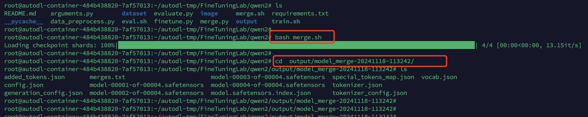           


# 2、关键知识点
## 2.1 gradient_accumulation_steps
`gradient_accumulation_steps` 梯度累积步数，是一个在深度学习模型训练过程中常用的参数，尤其是在处理大型模型时。它的主要作用是通过多次累积梯度后再进行一次参数更新，以减少显存占用、增加有效批量大小。

### 原理
在深度学习训练中，通常会将训练数据分成小批量（batch），对每个批次计算梯度并更新模型参数。当显存不足以容纳较大的批量时，可以使用 `gradient_accumulation_steps` 来分阶段积累梯度。

### 使用方法
在模型训练代码中设置 `gradient_accumulation_steps` 后，可以按如下方式操作：

1. 将实际的批量大小减小到显存允许的范围。
2. 每次计算得到的梯度累积到一定次数（由 `gradient_accumulation_steps` 指定）后，再统一进行模型的反向传播和权重更新。

### 优点
- **减小显存需求**：可以通过分批次计算和累积来避免一次性加载大量数据，从而节省显存。
- **增加有效批量大小**：通过多次累积梯度，实现更大的有效批量大小，获得更稳定的梯度估计。
- **更灵活的硬件支持**：使得在中小型显存的设备上也可以训练大型模型。

### 实例
假设我们希望使用批量大小为 32 的模型训练，但显存只能容纳 8 的批量大小，可以设置：

```python
batch_size = 8
gradient_accumulation_steps = 4
```

在每训练 4 个批次后，模型才会更新一次参数，等效于使用 32 的批量大小进行训练。

### 注意事项
- **训练时间增加**：由于积累了多次计算结果再更新参数，训练时间可能比直接使用大批量更长。
- **学习率调整**：积累梯度会影响有效批量大小，因此可能需要调整学习率以适应新的批量大小。

## 2.2 evaluation_strategy
`evaluation_strategy` 是一个用于控制模型在训练过程中如何进行评估的参数，主要用于指定评估的频率或方式，帮助追踪模型在验证集上的表现。这个参数通常在训练过程中设置，尤其是在使用框架如 Hugging Face Transformers 的时候。

### 参数选项
`evaluation_strategy` 通常有以下几种选项：

1. **"no"**：不进行评估。训练过程中完全不使用验证集进行评估。这适用于不需要中途监测验证结果的情况，但可能会导致无法及时发现过拟合或欠拟合。

2. **"steps"**：按固定的步数进行评估。设置后，模型会在每隔一定训练步数后（`eval_steps` 参数指定）进行评估。这适合在大数据集上训练模型时，定期监测模型的表现。

3. **"epoch"**：每个训练轮次结束后进行评估。设置后，模型会在每个完整的 epoch 结束后评估一次。这种方式适合数据集较小或 epoch 数量较小时使用，因为它能在每个完整的轮次后评估模型的整体性能。

### 作用与优点
通过设置 `evaluation_strategy`，可以在训练过程中监控模型的性能，及时调整超参数，避免过拟合或欠拟合。此外，这种定期评估还能让我们选择最优模型（通常可以使用早停技术，在验证集上性能不再提升时提前停止训练）。

### 注意事项
- **性能开销**：频繁评估会增加计算开销，尤其是在大数据集上，因此需要根据实际情况合理设置评估频率。
- **早停策略**：当结合早停策略时，`evaluation_strategy` 可以帮助避免不必要的训练。

## 2.3 learning_rate
`learning_rate` 是深度学习模型训练中的一个重要参数，用于控制模型在每次参数更新时步进的大小。它决定了模型对误差的敏感程度，并直接影响到模型的收敛速度和训练效果。

### 参数解释
`learning_rate` 决定了模型在每次计算梯度时，参数的更新步幅大小。这个步幅越大，模型参数更新得越快；反之则更新得越慢。学习率过大会导致模型跳过最优解，学习率过小则可能会导致训练时间过长，甚至陷入局部最优解。

### 选择合适的学习率
选择合适的学习率通常是训练深度学习模型时的一个关键问题。可以通过以下几种方式来选择或调整学习率：

1. **固定学习率**：指定一个固定的学习率值，例如 `learning_rate=0.001`。这种方式简单直接，适合较小的数据集或训练时间较短的任务。

2. **学习率衰减（Scheduler）**：在训练过程中逐渐减小学习率，使模型在接近最优解时调整得更细致。常见的调度器包括 `StepLR`、`ExponentialLR`、`CosineAnnealingLR` 等，它们会在训练过程中根据设定的规则自动调整学习率。

3. **自适应学习率优化器**：使用一些自适应学习率的优化算法，如 `Adam`、`RMSprop`、`Adagrad` 等，这些优化器会根据梯度的变化动态调整学习率，无需手动设置特定值。

4. **学习率热身（Warmup）**：在训练开始时使用较小的学习率，逐步增大到设定的学习率值，以避免模型在初始阶段参数更新过大导致不稳定。

### 注意事项
- **学习率的初始值**：通常在 `0.001` 到 `0.00001` 范围内试验，但具体数值依赖于模型和数据集。
- **调参策略**：如果模型收敛速度慢或在训练后期表现不佳，可以考虑调整学习率；也可以使用学习率调度器动态调整。
- **探索与调试**：在训练开始前可以使用一些工具（如学习率扫描）来探索适合的初始学习率。

## 2.4 lora_rank
`lora_rank` 是在 LoRA (Low-Rank Adaptation) 技术中常见的一个参数，专门用于控制模型在进行微调时的低秩矩阵的秩数。LoRA 是一种通过低秩矩阵进行参数高效微调（PEFT）的方法，它可以在保持原始模型参数不变的前提下实现有效的模型微调。

### LoRA 的基本原理
LoRA 的核心思想是：将模型的部分参数分解成低秩矩阵，然后仅对这些低秩矩阵进行微调，而不是直接调整所有参数。这种方式可以显著减少模型微调时的参数量，降低计算开销，尤其适用于大型模型（如 GPT-3、BERT 等）的微调场景。

`lora_rank` 参数决定了这个低秩矩阵的秩数，也就是矩阵分解的维度大小。更具体地说，`lora_rank` 决定了在 LoRA 中额外添加的低秩矩阵的大小和表示能力。

### `lora_rank` 的影响
- **表示能力**：较高的 `lora_rank` 值意味着更高的表示能力，微调时模型的适应性会更强，但同时需要的计算资源也更多。较低的 `lora_rank` 值则会减少参数量和计算需求，但可能限制微调效果。
- **计算与存储效率**：`lora_rank` 越低，表示低秩矩阵的维度越小，所需的存储和计算成本也会降低。因此，在计算资源有限的情况下，可以尝试降低 `lora_rank` 来提升训练效率。

通常在微调过程中需要在 `lora_rank` 和模型精度之间找到一个平衡点。

### 注意事项
- **调参建议**：如果微调后的模型效果不理想，可以尝试提高 `lora_rank` 的值；如果显存不足，可以适当降低 `lora_rank`。
- **经验范围**：常见的 `lora_rank` 值通常在 4 到 64 之间，但需要根据模型大小和任务要求进行调整。
- **结合 `lora_alpha`**：`lora_alpha` 参数控制低秩矩阵的缩放，可以结合调整这两个参数来获得更好的微调效果。


## 2.5 lora_alpha
`lora_alpha` 是 LoRA (Low-Rank Adaptation) 技术中的另一个关键参数，用于控制微调过程中低秩矩阵的缩放比例。它在 LoRA 的参数更新中起到平衡作用，影响低秩矩阵在模型整体参数中的权重大小，从而影响模型的微调效果。

### 参数解释
在 LoRA 中，`lora_alpha` 是一个缩放系数，用于调整低秩矩阵对模型最终参数更新的影响力。LoRA 使用的低秩矩阵通过 `lora_alpha` 进行缩放，将微调过程中学到的低秩矩阵变化与原始模型的权重结合。

### `lora_alpha` 的作用
- **调节微调力度**：`lora_alpha` 控制低秩矩阵的缩放，使得微调的影响力可以在较小的变化范围内对模型进行细致的调整。如果 `lora_alpha` 值过高，模型会更大程度地依赖低秩矩阵的变化，可能导致微调效果过于明显，出现过拟合风险。
- **平衡模型原始参数和微调参数**：通过调整 `lora_alpha` 的大小，可以在原始模型参数和微调参数之间找到适当的平衡点，从而在精度与泛化性之间取得较好的效果。

### 选择 `lora_alpha` 值
- **较低的 `lora_alpha` 值**：低缩放比例（如 `lora_alpha=16` 或更小）可以让微调过程更加稳定，不易过拟合。
- **较高的 `lora_alpha` 值**：高缩放比例（如 `lora_alpha=32` 或更大）则可能使微调过程更快收敛，但可能会牺牲一定的泛化性能。

### 使用示例
通常在配置 LoRA 微调时，与 `lora_rank` 参数一同设置。例如：


### 注意事项
- **结合 `lora_rank` 调整**：`lora_alpha` 值的选择通常与 `lora_rank` 配合使用，可以共同影响模型的精度与训练效率。
- **经验值**：一般可以从 16 或 32 开始试验，逐步调整，查看模型在验证集上的表现以确定最优值。


## 2.6 lora_dropout
`lora_dropout` 是 LoRA (Low-Rank Adaptation) 技术中的一个重要参数，用于控制在微调过程中低秩适应模块的 dropout 率。它主要用于增强模型的泛化能力，防止过拟合。

### 参数解释 
`lora_dropout` 指定了在训练期间将被随机丢弃的神经元比例，通常以小数表示。例如，`lora_dropout=0.1` 表示有 10% 的神经元在每次训练迭代中被随机选择性忽略。这种机制的引入可以帮助模型在训练过程中减少对某些特征的依赖，从而提高模型在未见数据上的泛化能力。

### `lora_dropout` 的作用
- **防止过拟合**：通过在训练过程中随机丢弃一部分神经元，`lora_dropout` 可以减轻模型对训练数据的过拟合，尤其是在训练样本数量相对较少时。
- **增强模型鲁棒性**：Dropout 机制使模型在训练时不会过于依赖某些特定的神经元，有助于模型学习更稳健的特征表示。
- **改善训练过程**：在一些情况下，适当的 dropout 可以加速训练收敛，因为模型需要学习到更为通用的特征，而不是依赖于特定的路径或结构。

### 选择 `lora_dropout` 值
- **常用值**：一般来说，`lora_dropout` 的值通常在 `0.1` 到 `0.3` 之间。可以从 `0.1` 开始，然后根据验证集的表现逐渐调整。
- **实验调整**：在微调过程中，观察模型在验证集上的性能，适时调整 `lora_dropout` 值，以找到最佳的泛化性能。

### 注意事项
- **平衡使用**：`lora_dropout` 的设置需要与其他超参数（如学习率和 `lora_rank`）配合考虑，确保整体训练效果最优。
- **不同任务的调整**：根据具体的任务和数据集特性，`lora_dropout` 的最佳值可能会有所不同，需要进行实验以找到合适的设置。


## 2.7 指标的值
各个指标的值可以通过观察数值大小来初步判断模型的效果。下面是这些指标的具体解释和如何解读其值：
### 1. **损失（Loss）**
   - **定义**：损失表示模型预测结果与真实标签之间的差距。常见的损失函数有交叉熵损失（Cross-Entropy Loss）、均方误差（Mean Squared Error）等。
   - **解读**：
     - **值越小越好**。损失值越小，表明模型预测结果与真实结果之间的差距越小。
     - 损失的具体值大小受任务和数据集影响。初始训练时损失值通常较大，随着训练进行逐渐降低。
     - 若训练集损失低但验证集损失高，可能存在**过拟合**。

### 2. **精度（Accuracy）**
   - **定义**：精度表示模型预测正确的样本占总样本的比例。通常用于分类任务，计算方式为正确分类数除以总样本数。
   - **解读**：
     - **值越高越好**，接近1（或100%）表明模型有很高的准确率。
     - 过低的精度值表明模型预测效果较差，可能需要调整模型结构或超参数。
     - 如果训练集精度高但验证集精度低，也可能表明模型过拟合。

### 3. **困惑度（Perplexity）**
   - **定义**：困惑度是一种衡量模型在生成任务（如语言模型）中性能的指标。它是对模型在数据上的预测不确定性的一种度量。计算上，困惑度是损失的指数函数。
   - **解读**：
     - 困惑度**越低越好**。在语言建模任务中，较低的困惑度表示模型能够更好地预测下一个词。
     - 困惑度的值越高，表明模型在预测下一个词时越不确定。
     - 通常，将困惑度与损失一起观察，以全面评估模型的生成质量。

### 综合解读
- **训练损失与验证损失**：同时观察训练集和验证集上的损失值，确保验证集上的损失值也随训练过程逐渐减小。如果验证集损失在某一阶段停止下降甚至上升，则可能发生了过拟合。
- **多指标综合观察**：在分类任务中，精度和损失通常搭配使用，而在生成任务中，困惑度和损失更为关键。
  
这些指标值通常会在每个训练周期（epoch）或评估周期后打印或记录，方便监控模型的性能表现。


## 2.8 槽位填充（Slot Filling）
在槽位填充（Slot Filling）任务中，模型的性能通常通过精确率（Precision）、召回率（Recall）、F1分数（F1 Score）等传统指标来评估，而有时也会使用BLEU-4分数（BLEU-4 Score）来评价预测结果和真实值的相似性。以下是这些指标的详细介绍：

### 1. 精确率（Precision）

**精确率**衡量的是模型预测出的槽位中，实际为正确槽位的比例。它关注的是模型预测的“正确性”，尤其在意的是预测的正样本是否为真正的正样本。例如，如果模型在槽位填充任务中识别出了几个槽位标签，那么精确率会告诉我们这些标签中有多少是正确的。

- **True Positives（TP）**：正确预测为某槽位的样本数。
- **False Positives（FP）**：错误预测为某槽位的样本数。
- **计算公式:** TP/(TP+FP)      

**示例**：如果模型预测了10个“日期”槽位，其中8个是正确的，2个是错误的，那么精确率为80%。

### 2. 召回率（Recall）

**召回率**衡量的是实际为正样本的槽位中，模型正确识别出来的比例。召回率关注的是模型“覆盖的全面性”，即是否漏掉了某些需要识别的槽位。
- **True Positives（TP）**：正确预测为某槽位的样本数。
- **False Negatives（FN）**：漏掉的槽位，即真实值中存在但模型未识别出的槽位。
- **计算公式:** TP/(TP+FN)              
**示例**：假设实际有15个“日期”槽位，但模型只预测对了8个，漏掉了7个，那么召回率为53.33%。

### 3. F1 分数（F1 Score）

**F1分数**是精确率和召回率的调和平均数，用于在精确率和召回率之间取得平衡，尤其当二者存在显著差异时，F1分数可以帮助全面衡量模型的槽位填充性能。                  
**公式:** 2*[(Precision*Recall)/(Precision+Recall)]            
**示例**：如果精确率为80%，召回率为53.33%，则F1分数约为64.52%。              

### 4. BLEU-4 分数（BLEU-4 Score）

**BLEU（Bilingual Evaluation Understudy）分数**最早用于评估机器翻译模型的输出质量，通过计算预测文本和参考文本之间的n-gram重叠来衡量相似度。在槽位填充任务中，尤其是在复杂的对话系统中，BLEU分数可以用于评估预测的槽位值和真实槽位值的相似性。

**BLEU-4分数**特指四元组（4-grams）的BLEU分数。它关注的并不是单个词的匹配，而是连续四个词的匹配情况，因此对于语义和上下文相关的槽位填充任务，BLEU-4分数能更好地反映填充结果的自然性和正确性。

**示例**：如果模型在“日期”槽位中输出“今晚八点”，而真实值是“今晚八点”，那么BLEU-4分数较高。如果模型输出“今晚”而真实值是“今晚八点”，BLEU-4分数则较低，因为4-grams匹配不足。

### 如何选择合适的指标

在实际应用中，不同的指标可以侧重于不同的性能考察点：
- **精确率**适合当槽位填充结果需要高度准确的情况。
- **召回率**适合对覆盖率要求高的任务，确保不遗漏槽位。
- **F1分数**适合对精确率和召回率都看重的场景。
- **BLEU-4分数**更适合在生成任务中使用，特别是需要自然语言输出时，用于评估模型生成的槽位值是否自然、准确。

### 实际应用场景中的示例

在对话系统的槽位填充中，例如餐厅预订系统，以上各项指标的应用场景可能为：
- 使用**精确率**和**召回率**评估填充是否准确。
- 使用**F1分数**对整体填充效果进行综合评估。
- 使用**BLEU-4分数**评估填充结果的自然性和准确性，特别是对于复杂的槽位值（如“今晚八点”）等带有上下文或语义依赖的槽位。

综合这些指标可以帮助全面了解模型在槽位填充任务中的表现，并帮助选择合适的改进方向。


              
              
