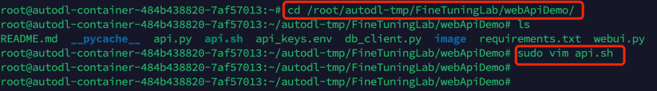
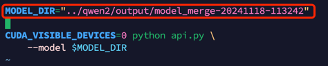
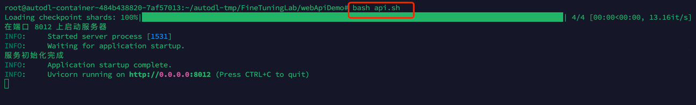
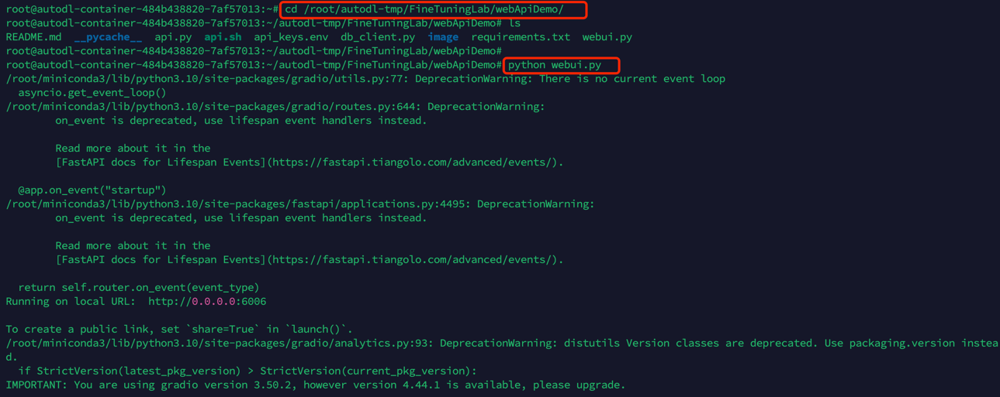
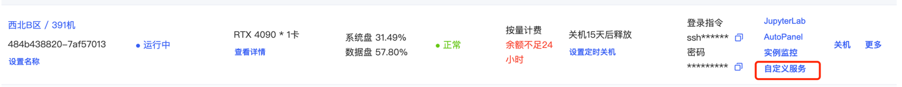
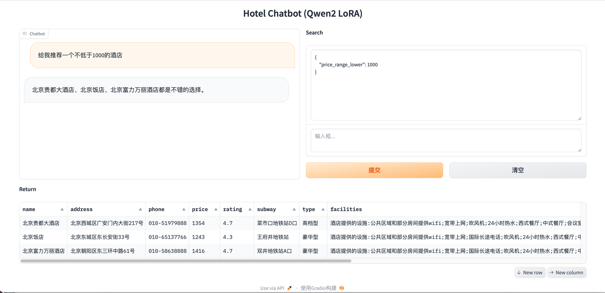

# 模型推理接口应用
## (1)运行API接口服务
在运行测试之前执行如下命令安装依赖包          
`cd /root/autodl-tmp/FineTuningLab/webApiDemo`        
`pip install -r requirements.txt`                           
每个软件包后面都指定了本次视频测试中固定的版本号          
打开一个命令行终端，执行如下命令                     
`cd /root/autodl-tmp/FineTuningLab/webApiDemo`                              
`sudo vim api.sh`                             
         
修改如下参数，根据实际情况进行替换为合并后的模型                  
           
修改后保存退出，然后执行                              
`bash api.sh`                                                

## (2)运行web服务
再开启一个新的命令行终端，执行如下指令          
`cd /root/autodl-tmp/FineTuningLab/webApiDemo`                         
`python webui.py`                          
           
服务运行成功后，在AutoDL实例中可以通过自定义服务访问到web页，单击跳转后进入如下截图所示web测试页面          
如:给我推荐一个不低于1000的酒店              
         
          

              
              
