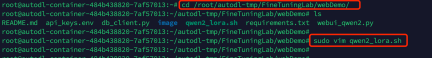
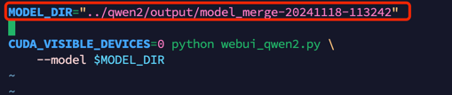
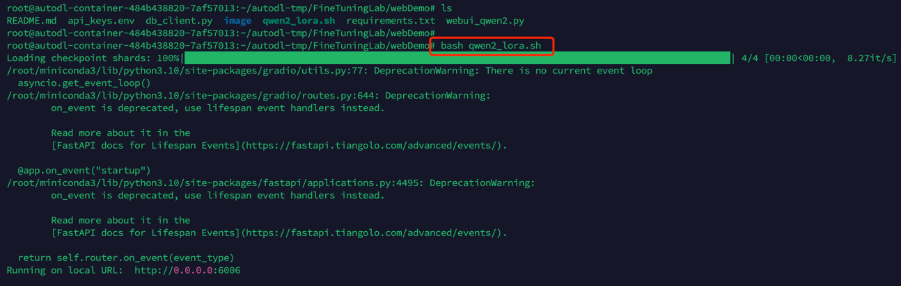
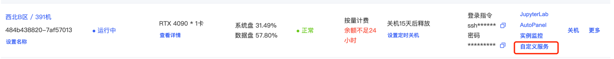
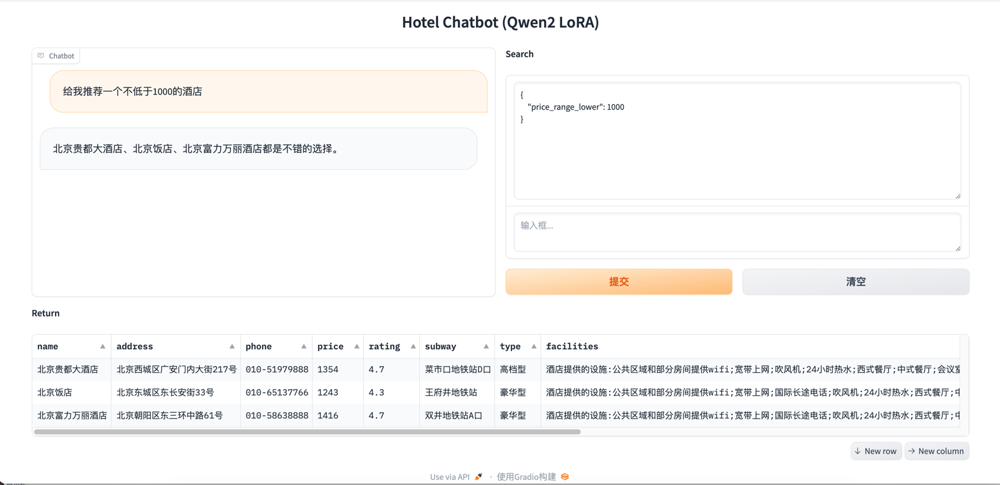

# 模型应用测试
打开一个命令行终端，执行如下命令                                   
`cd /root/autodl-tmp/FineTuningLab/webDemo`                              
`sudo vim qwen2_lora.sh`                               
                
修改如下参数，根据实际情况进行替换为合并后的模型                  
             
修改后保存退出，然后执行bash qwen2_lora.sh                 
            
服务运行成功后，在AutoDL实例中可以通过自定义服务访问到web页(记得把之前打开的tensorboard服务关掉)，单击跳转后进入如下截图所示web测试页面          
如:给我推荐一个不低于1000的酒店              
                
             

              
              
